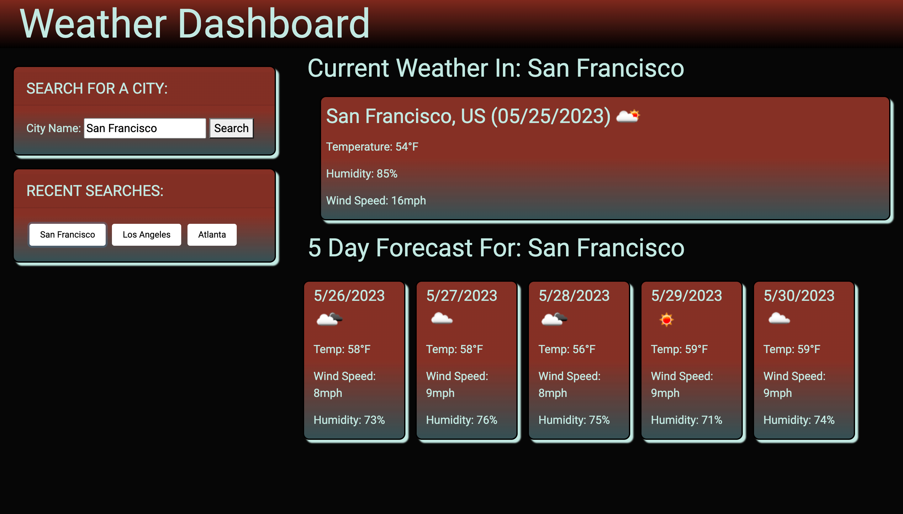

# Weather Dashboard

## Description

The Weather Dashboard app is deisgned so you can search for any city and get the current weather as well as the forecast for the next five days.

The goal of this project was for anyone to search for the weather of a city they live in, visit often, or interested in visiting. The application stores users data so they can easily access previous searches. I dynamically created the elements that display the temperature, humidity, and forecast so that when a user searches a different city, there is very little change in the display. I utilized openweathermaps api to gather the weather information I needed and I had to chain a couple fetch requests together in order for the user to search a city and get the desired results. 

In this project I learned more about keeping your code modular. For the forecast element I created a for loop that iterates through the selected time frames so that it dynamically creates the five cards in one loop as opposed to appending 5 different cards to the verall element. I also learned tge proper way to use fetch requests. It was challenging at first to get the second url to work after getting the first geocoding api, but after playing around a bit I was able to make sense of how fetch requests work and write code that functioned properly and efficiently.

## Resources

[Deployed Site](https://cdgonzo23.github.io/weather-dashboard/)

[Repository](https://github.com/cdgonzo23/weather-dashboard)

### ScreenShots
